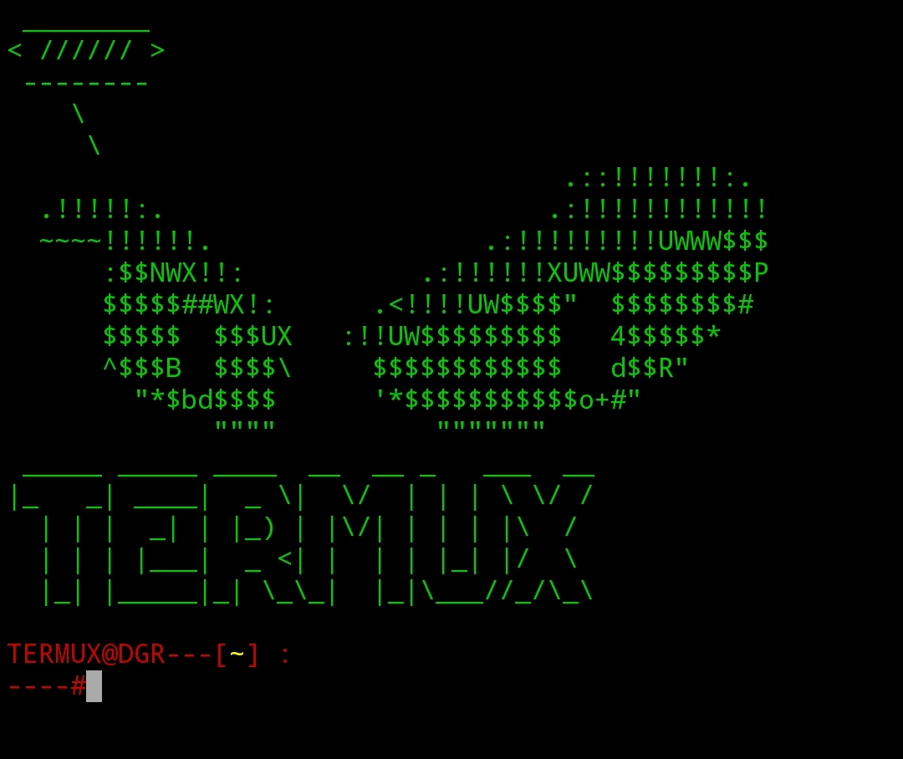

# t-style

Hi all ,

Now, a newer an nicer version of termux style is out .

Style your termux like a pro hacker .

There are few step to install it so it is easy to install.

*****Requirements*****

- git installed

- figlet 

- cowsay

*****Installation*****

- git clone https://github.com/dev22419/t-style

- cd t-style

- chomd +x run.sh

- ./run.sh

*****Auto-install*****

- apt-get install git && git clone https://github.com/dev22419/t-style && cd t-style && chmod +x run.sh && bash run.sh

If there is any mistake , tell me to fix it .

View image in file.png

